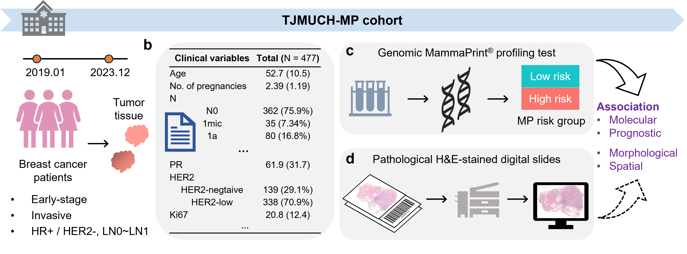

# CPMP: AI-driven computational pathology for recurrence risk assessment in early-stage breast cancer 

<!-- > We presented an AI-driven computational pathology framework (CPMP) for MP-informed recurrence risk assessment in patients with early-stage BC using histopathological WSIs.   

## Highlights

**Motivation**

Recurrence of breast cancer (BC) is a primary cause of mortality and is associated with poor prognosis. The genomic MammaPrint (MP) test is designed to stratify risk and evaluate chemotherapy benefits for early-stage HR+/HER2- BC patients. However, it fails to reveal spatial tumor morphology and is limited by high costs. 

**Hypothesis**

We hypothesized that morphological patterns in routine histological slides associated with prognosis can be bridged by the MP molecular biomarker.  

**Key Ideas & Main Findings**
1. **Data Establishment**. We established a HR+/HER2- BC clinical cohort, TJMUCIH-MP, with 477 female patients from TJMUCIH. The patient cohort was comprised of clinicopathologic characteristics, digital WSIs, and genomic MP diagnostic test results.
<div align="center">
	
</div>

2. **Methodological Innovation**. We developed a weakly-supervised learning model CPMP, capable of aggregating morphological and spatial features using the agent-attention transformer, to efficiently predict MP recurrence risk from annotation-free BC pathological slides. 
<div align="center">
	
</div>

3. **Knowledge Discovery**. We further leverage this artificial intelligence (AI) model for spatial and morphological analysis to explore histological patterns related to MP risk groups. CPMP captures the spatial arrangement of tumors at the whole-slide-level and highlights differences in intercellular interaction patterns associated with MP. We characterized the diversity in tumor morphology, uncovering MP High-specific, Low-specific, and colocalized morphological phenotypes that differs in quantitative cellular compositions.  
<div align="center">
	
</div>

4. **External Validation**. We conducted prognostic analysis on the external cohort. CPMP model highlighted superior generalization capabilities on the TCGA-BRCA cohort, exhibiting a significant risk-group stratification on multiple prognostic indicators. 

5. **Clinical Application**. CPMP model has the potential to serve as a flexible supplement integrating into routine clinical diagnostic workflow for early-stage BC patients.
<div align="center">
	
</div> -->


## User Guide

### 1. Requirements and installation

#### Operating systems

The codes have been implemented on Ubuntu 22.04 LTS. The installation in other operation systems (Windows or MAC) should be cautious due to python packages.

#### Packages and Installation
CPMP is implemented by Python 3.8 and PyTorch 2.2. The packages required have been provided in the file [environments.yml](environments.yml)

✨ To install the Conda environment, you can run the command in the terminal:

```shell
conda env create -f environments.yml
conda activate cpmp
```

**NOTE**: The codes require package `openslide python`, but its installation is different between Linux and Windows. Please follow the [offical documentation](https://openslide.org/api/python/) to install and import it in python to make sure it can work correctly. 

If `ctranspath` feature extractor is further used (which was utilized for ablation study in our work), `timm` library should be installed as described in [CTransPath](https://github.com/Xiyue-Wang/TransPath).

### 2. Data 

The in-house cohort is accessible upon request. The data can only be used under the condition that the request is for non-profit, purely academic research purposes, and the requesting researchers must provide valid ethics approval from their institution. 

The TCGA-BRCA data (slides and clinicopathological information) are available at [portal.gdc.cancer.gov](https://portal.gdc.cancer.gov/). The follow-up data are available at [TCGA Clinical Data Resource](https://doi.org/10.1016/j.cell.2018.02.052). 

You should put whole slide images into this path --> configured parameter: `datapath`

### 3. Train, Evaluation and Inference

The CPMP model is based on the weakly supervised multi-instance learning (MIL) framework. It includes: 

#### **Whole slide images processing**

```shell
datapath="/home/cyyan/Projects/TJMUCHMMP-cohort/"
patchpath="results/TJMUCH_MMP_1WsiPatching_20x"

tile_size=512
overlap_size=512
downsample_factor=2 # {tile_size: ds_factor} mapping should be {256: 1, 512: 2, 1024: 4, 2048: 8}

echo "WsiPatching..."
python WsiTiling.py \
  -s  $datapath \
  -d  $patchpath \
  -ps $tile_size \
  -ss $overlap_size \
  --patch \
  --bgtissue \
  --stitch
```


#### **Feature representation**

```shell
datapath="/home/cyyan/Projects/TJMUCHMMP-cohort/"
patchpath="results/TJMUCH_MMP_1WsiPatching_20x"
featspath="results/TJMUCH_MMP_2Feats_20x"
tocsvpath=$patchpath"/process_list_autogen.csv"

batchsize=500

echo "FeatsExtraction..."
pretrain_model="uni"
CUDA_VISIBLE_DEVICES=0 python FeatsExtracting.py \
  --feat_to_dir $featspath"_"$pretrain_model \
  --csv_path $tocsvpath \
  --h5_dir $patchpath \
  --pretrain_model $pretrain_model \
  --slide_dir $datapath \
  --slide_ext ".svs" \
  --batch_size $batchsize \
  --resize_size 224 \
  --custom_downsample $downsample_factor \
  --float16
```

**NOTE 1**: Pre-trained **UNI** foundation model can be found at [github.com/mahmoodlab/UNI](https://github.com/mahmoodlab/UNI)

**NOTE 2**: You can also apply more foundation models (['gigapath'](https://github.com/prov-gigapath/prov-gigapath), ['H-optimus-0'](https://github.com/bioptimus/releases/tree/main/models/h-optimus/v0), ['phikon'](https://github.com/owkin/HistoSSLscaling), ['virchow'](https://huggingface.co/paige-ai/Virchow), ['ctranspath'](https://github.com/Xiyue-Wang/TransPath), ...) as we did in the ablation study. You need to `mkdir pretrained_model_weights/` and put these pretrained models into `pretrained_model_weights/`.


#### **Patient splitting**

```shell
csvinfopath="results/MPcohort_info.csv"
splitspath="results/TJMUCH_MMP_3CaseSplits"
featspath="results/TJMUCH_MMP_2Feats_20x"

labelname="MMPrisk"

echo "Cross Validation splitting ..."
echo "5 times 5 folds cross validation mode split."
python CaseSplitting.py \
  --task_name "MMPrisk" \
  --csv_info_path $csvinfopath \
  --split_to_dir $splitspath \
  --times 5 \
  --kfold 5 \
  --val_frac 0 \
  --test_frac 0.2 \
  --label_column_name $labelname \
  --label_list "Low" "High"\
  --slide_featspath $featspath\
  --seed 2020
```
**NOTE**: `val_frac` is set to `0.0` and `test_frac` is `0.2`. This means that we splitted 20% data for testing and the remained is for `kfold` cross-validation. 

**NOTE**: you can also execute [this bash script](/run_patch_feats_split.sh) for [Whole slide images processing](#whole-slide-images-processing), [Feature representation](#feature-representation), and [Patient splitting](#patient-splitting) in one stop.


#### **CPMP model training**

```shell
CUDA_VISIBLE_DEVICES=0 python ModelTraining.py --config cfgs/TJMUCH_MMP.yaml
```

or 

```shell
sh run_train_MMPrisk.sh # also write train-logs to the local.
```

**NOTE 1**: The config hyperparameters file `cfgs/TJMUCH_MMP.yaml` can be refered to [HERE](#parameter-configs-for-model-training)

**NOTE 2**: You can also observe loss curves and indicator changes in **Browser (eg. localhost:6006)** during model training by **tensorboard**.

```shell
cd ${results_dir}${datasource}${task}${exp_code}
tensorboard --logdir . --port=<your port, eg. 6006>
```


#### **Independent evaluation**

The training scripts above will generate the evaluated quantitative results to the local in the form of `csv-format` tables. 

We also implemented a script for individual quantitative evaluation (as what we did in the **efficiency evaluation**). You can execute it by modifying the specific config parameters.

```shell
python Evaluation.py -m <absolute exp_code path> -n <No. of tiles sampled, eg. 5,000/10,000>
```

#### **Inference on external data**

A new WSI (such as slides in TCGA-BRCA) can be directly inferred. Also, the attention heatmap results at the whole-slide level will be generated by the CPMP model. 

You should set the `data_dir` to the path of your slide data, refer to more parameter configurations in [wsi_heatmap_params.yaml](cfgs/wsi_heatmap_params.yaml) for guidance.

```shell
python SlideInference.py --configs cfgs/wsi_heatmap_params.yaml 
```

or you can set parameters directly, 

```shell
python SlideInference.py --configs cfgs/wsi_heatmap_params.yaml --opts \
        data_dir    <your_slide_rootpath> \
        slide_ext   <format of slide, eg. .svs> \
        ckpt_path   <pre-trained model names, eg. xx/CPMP_v1.pt>
```
where the parameter `ckpt_path` is the path of the trained models, and `data_dir` represents the path of whole slide images. You can find and download the trained models in our shared OneDrive link below.


#### Parameter configs for model training

Configured hyper-parameters for [model training](#cpmp-model-training) are listed below:

```YAML
CKPTS:
  datasource:     TJMUCH_MMP
  task:           MMPriskRegression
  exp_code:       debug
  
  wsi_root_dir:   /home/cyyan/Projects/TJMUCHMMP-cohort/                       # wsi root path
  data_root_dir:  results/TJMUCH_MMP_2Feats_20x_uni                            # features representation data directory for tiles
  csv_info_path:  results/MPcohort_info.csv                                    # csv file with slide_id and label information
  split_dir:      results/TJMUCH_MMP_3CaseSplits_20x/MMPrisk_KFoldsCV          # casesplitting root path
  use_h5: False                                                                # use h5 file or not for coords

  results_dir:    results/developed_models                                     # results directory for model, logs, and test evaluation results
  cfg_to_name:    params_setting.txt                                           # hyper-params setting file for saving

  indep_data_root_dir:                                                         # features representation data directory for indepedent test data
  indep_csv_info_path:                                                         # indepedent test csv file wih slide info and mp label for evaluation

  zeroshot_idx_dir: # results/TJMUCH_MMP_2Feats_20x_plip/pt_files_zs_tissueidx # noisy filtering exp. use zeroshot index for training


TRAIN:
  model_type:  CPMP                 # (default: CPMP), and comparative models, ['TransMIL', 'CLAM', 'ABMIL', 'Transformer']
  encoding_dim:  1024               # patch encoding dim, [1024, 768, 2048]
  model_size: uni1024               # size of model, ['resnet_small', 'ViT_small', 'ccl2048', 'gigapath1536']
  agent_token_num:                  # the number of agent tokens in for CPMP, (default: 1), 'None' indicates 'Transformer' model

  num_perslide: 5000                # None will cover all samples, for data sampling, __getitem__
  label_col: MMP_index              # label column name
  labels_list: ["Low", "High"]

  n_classes: 1                      # number of classes (default: 1) for regression or classification
  loss_func: MSE                    # slide-level classification loss function, (default: 'MSE') or 'CE' for classification
  loss_func_aux: MSE                # slide-level auxiliary loss function

  log_data: True                    # log data using tensorboard
  weighted_sample: False            # enable weighted sampling
  

HyperParams:
  max_epochs: 1000                  # maximum number of epochs to train (default: 1000)
  batch_size: 1                     # batch size commonly set to 1 for MIL, we utilized Gradient Accumulation below.
  gc: 32                            # Gradient Accumulation Step. HERE, Gradient Accumulation is equal to common batch size.
  lr: 0.0001                        # learning rate (default: 0.0001)
  optim: adam                       # optimizer, adam sgd adamW radam Lamb
  scheduler: LinearLR               # optimizer scheduler [CosineAnnealingLR CyclicLR LinearLR OneCycleLR StepLR]
  drop_out: 0.5                     # a float num, enable dropout (p=0.5)
  early_stopping: True              # enable early stopping or not
  early_stopping_metric: score      # early stopping metric 'score' or 'loss'

  reg: 0.0001                       # weight decay (default: 1e-4)
  lambda_reg: 0.00001               # L1-Regularization Strength (Default 1e-5)


CROSSVALIDATAION:
  times: 5                          # number of times (default: 5)
  t_start: -1                       # start time (default: -1, last time)
  t_end: -1                         # end time (default: -1, first time)
  k: 5                              # number of folds (default: 5)
  k_start: -1                       # start fold (default: -1, last fold)
  k_end: -1                         # end fold (default: -1, first fold)


COMMON:
  gpu: '0'
  seed: 2020                        # random seed for reproducible experiment (default: 2020)
  workers: 8                        # data loader workers
```


### 4. Trained models weights

The pre-trained weights of the CPMP model on our in-house cohort can be available soon.


## Contact

If you have any problems, just raise an issue in this repo.


## Acknowledgements
Our code is developed on the top of [CLAM](https://github.com/mahmoodlab/CLAM), [PhiHER2](https://github.com/gatsby2016/PhiHER2), and [Agent-Attention](https://github.com/LeapLabTHU/Agent-Attention). 


If you find our work useful in your research, please consider giving this repo a star. Thank you~
